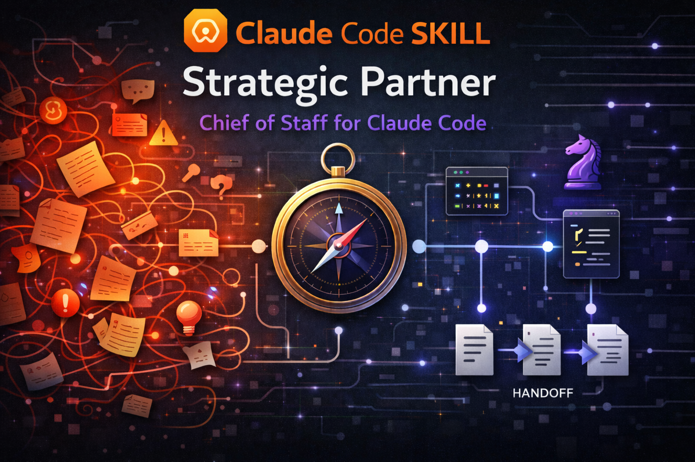

<p align="center">
  
</p>

[](CHANGELOG.md)

# strategic-partner

A strategic advisory skill for Claude Code that separates thinking from building. It thinks with you in one session — asking the right questions, challenging assumptions, framing problems before jumping to solutions — then packages implementation for fresh sessions where the full context window is available. Decisions persist. Context stays clean. The advisory persona is the primary deliverable, not the prompts.

---

## The problem

AI coding assistants degrade as conversations grow. Every tool call, file read, and back-and-forth exchange pushes the original instructions further from the model's attention. By the time you're deep into implementation, the careful thinking from earlier has been diluted by hundreds of intermediate results.

Think of it like a meeting that started with a clear agenda but kept going for six hours. By hour four, decisions are being made on autopilot — not because anyone stopped caring, but because the original focus got buried under everything that came after.

Most workflows ignore this. You open one session, plan and build in the same window, and by the time you're in the weeds, decisions are being made mid-build with degraded instruction-following. When context fills up completely, everything is lost.

The strategic partner fixes this by enforcing a separation: persistent advisory context where decisions accumulate, and disposable execution context where clean context matters most.

---

## Who is this for

**Solo developers** — A second brain that interrogates your assumptions before you build, routes to the right tool, and remembers decisions across sessions so you don't re-litigate them.

**Team leads** — Consistent prompt quality across implementation sessions, with a decision log that survives context resets. Your architectural intent carries forward even when execution happens in fresh windows.

**Non-technical PMs** — You can describe what you need in plain language. The SP handles the translation into technical prompts, breaks large features into phased delivery, and reports back in terms you can act on. You never need to know which skill or model is best for a task.

---

## How it works

### Two sessions, one loop

```
+---------------------------------+     +---------------------------------+
|  SESSION 1: ADVISOR (persistent) |     |  SESSION 2: EXECUTOR (ephemeral) |
|                                  |     |                                  |
|  /strategic-partner              |     |  /feature-dev                    |
|                                  |     |  (or whatever skill SP chose)    |
|  - Thinks with you               |     |  - Builds what SP specified      |
|  - Challenges your assumptions   |     |  - Follows the prompt exactly    |
|  - Crafts implementation prompts |     |  - Commits when done             |
|  - Routes to the right skill     |     |  - You close this when finished  |
|  - Tracks decisions and state    |     |                                  |
|  - Stays open across phases      |     |  Opens fresh for each prompt.    |
|                                  |     |  No accumulated context.         |
|  YOU KEEP THIS ONE OPEN.         |     |  DISPOSABLE.                     |
+----------------+-----------------+     +----------------+-----------------+
                 |                                        |
                 |  1. SP crafts prompt ----------------> |
                 |                                        |  2. You paste & run
                 |                                        |
                 |  4. SP reviews, plans next  <--------- |  3. You report back
                 |                                        |     what happened
                 +----------------------------------------+
```

You describe what you need. The SP asks clarifying questions, then delivers a self-contained prompt targeting the right skill with the right model. You paste that prompt into a fresh session — full context window, zero accumulated baggage. When it finishes, you report back. The SP reviews what landed, extracts lessons, and crafts the next prompt.

**The SP never builds. The executor never decides.** That separation is what makes both work.

### Fast lane for small tasks

Not every task needs the full cycle. After the Advisory Completion Gate confirms you're done thinking, small mechanical tasks can be dispatched directly via agent — same fresh context, without the copy-paste overhead. Fast Lane is a delivery shortcut, not a personality change: the SP still thinks first, recommends a path, and gets your consent before dispatching. The simplicity score and solution ambiguity gate are always displayed, making the routing decision auditable.

---

## What the SP does before any work starts

This is where the value is. Before routing a single task, the SP runs several checks that prevent wasted effort:

**Premise challenge** — Every request is evaluated against 4 trigger conditions: does it name a technology before stating a problem? Describe how before why? Assume a root cause without evidence? Frame a solution instead of a problem? When triggers fire, the SP pushes back with pointed questions before any work begins.

**Forced alternatives** — For non-trivial tasks, the SP presents 3 distinct approaches before routing: Path A (minimal — smallest change), Path B (recommended — the SP's best judgment with rationale), and Path C (lateral — a reframing that might unlock a better outcome). You pick. Then it routes.

**Confidence labels** — Recommendations within prompts carry SAFE or RISK labels so the executor knows which suggestions are well-supported and which involve judgment calls.

**Advisory Completion Gate** — Before any prompt, dispatch, or script is crafted, the SP verifies 5 hard conditions: problem is framed, alternatives explored, trade-offs surfaced, user confirmed direction, and definition of done established. If any condition is unmet, the SP stays in advisory mode. This prevents the most common failure: jumping from brainstorming to implementation before thinking is done.

**Advisory Reset** — After every implementation cycle (user runs a prompt, or an agent completes a dispatch), the SP explicitly resets to advisory mode. "Back in advisory mode. I am reviewing the result, not continuing the build." This prevents implementation momentum from carrying into the next decision.

**Wired cognitive patterns** — 14 named thinking heuristics (Bezos one-way doors, Munger inversion, Jobs focus-as-subtraction, and 11 more) are wired to specific decision points with mandatory triggers and actions. They fire automatically at the right moments — not a decorative reference table.

**Cross-model review** — For high-stakes decisions (irreversible changes, large blast radius, unresolved disagreements), the SP can dispatch a curated brief to OpenAI's Codex CLI for independent adversarial review, then synthesize a three-way perspective: your position, the SP's position, and Codex's position. Optional — requires Codex CLI installed.

---

## What you get

Your team needs to build a **user onboarding flow** for a SaaS product. Here's what happens:

You open Claude Code and type:

```
/strategic-partner
```

Then say: *"We need to build an onboarding flow"*

**Strategic Partner responds:**

> **Triggers:** #4 fired (solution-shaped — "onboarding flow" describes a feature, not a problem).
>
> Before we scope this — what user problem does onboarding solve? Are new users dropping off? Confused by the setup? Missing a key activation step?

You clarify: *"New signups aren't completing setup — 60% drop off before connecting their first data source."*

> Good. This touches **auth**, **UI**, **backend state**, and **email triggers** — 4 concern areas. Your CLAUDE.md says React + Tailwind, no component library for modals yet.
>
> **Path A (Minimal):** 3-step inline wizard, no modal, connects existing setup flow. Ships fast, might need rework later.
> **Path B (Recommended):** Dedicated onboarding route with progress tracking, broken into 3 phases. Solid foundation.
> **Path C (Lateral):** Skip the wizard — auto-detect the user's intent from their first actions and surface contextual setup prompts. Higher effort, potentially higher activation.
>
> I'd go with **Path B** — it balances speed with a foundation that won't need rework. Path C is interesting but unproven for your user volume.

You pick Path B. The SP delivers 3 ready-to-paste prompts:

| Phase | Target skill | What it does |
|-------|-------------|-------------|
| **1 — Research** | *[from routing matrix]* | Read 5 files, map existing auth flow, identify where onboarding state should live |
| **2 — Build UI** | *[from routing matrix]* | WelcomeScreen + 3-step wizard, mock data only, no backend calls yet |
| **3 — Wire up** | *[from routing matrix]* | Connect wizard to user state, trigger welcome email on step 3 completion |

Each prompt includes: files to read first, constraints from CLAUDE.md, verification checklist, SAFE/RISK labels on key recommendations, expected commit message, and explicit NOT-in-scope exclusions.

You paste Phase 1 into a **new terminal tab**. It runs. You come back and say "done." The SP reviews the git log, then gives you Phase 2. Repeat until the feature ships.

### The key difference

| Aspect | Normal session | With the SP |
|--------|---------------|-------------|
| **Planning** | Discovered mid-build | Surfaced before any work starts |
| **Assumptions** | Unchallenged | Premise-checked, alternatives explored |
| **Big tasks** | One session, degrades at scale | Phased prompts, each with full context |
| **Knowledge** | Dies with the session | Persists via Serena memory and handoffs |
| **Tool selection** | You pick | SP routes dynamically from your installed tools |
| **Confidence** | Implicit | SAFE/RISK labels on recommendations |

---

## Quick start

### Install

```bash
# Via npx (recommended)
npx skills add https://github.com/JimmySadek/strategic-partner

# Via skillshare
npx skillshare install https://github.com/JimmySadek/strategic-partner

# Manual — clone to your preferred skills directory
git clone https://github.com/JimmySadek/strategic-partner.git <your-skills-dir>/strategic-partner
```

### Setup

After installing (via skillshare or git clone), run the setup script:

```bash
cd /path/to/strategic-partner
./setup
```

This registers subcommands with Claude Code. The `/strategic-partner:update` subcommand re-runs setup automatically after each update.

### Run

```
/strategic-partner
```

The skill loads an advisory persona, scans your project, and asks what you're working on.

### Resume from a previous session

```
/strategic-partner .handoffs/onboarding-flow-0304-1430.md
```

### Aliases

`/strategic-partner`, `/advisor`, `/sp` all invoke the same skill.

---

## What's included

The SP operates through a lean core (SKILL.md) that loads reference material on demand:

- **Strategic advisory and prompt crafting** — the core loop: discover, challenge premises, present alternatives, route, craft, review
- **Premise challenge system** — evaluates every request against 4 trigger conditions before accepting it at face value
- **Forced alternatives** — A/B/C path analysis before every non-trivial task, with trade-offs stated
- **Skill and MCP routing** — builds a routing matrix from your installed tools and picks the best match per task
- **Implementation boundary** — the SP is not allowed to implement in its own session, with 3 behavioral gates (Advisory Completion, Advisory Reset, Post-Dispatch Recovery) enforcing the separation
- **Fast Lane dispatch** — subordinate delivery mechanism for small, reversible tasks; requires Advisory Completion Gate to pass first; detailed mechanics loaded on demand from reference file
- **SAFE/RISK confidence labels** — recommendations carry explicit confidence signals for executors
- **Cross-model adversarial review** — dispatches curated briefs to Codex CLI (GPT-5.4) for independent review on high-stakes decisions
- **Memory architecture** — stewards all 4 persistence layers (CLAUDE.md, .claude/rules/, auto-memory, Serena) to ensure decisions survive across sessions
- **Context handoff management** — monitors context pressure and preserves full session state before it degrades
- **Cognitive patterns** — 14 named thinking heuristics wired to specific decision points with mandatory triggers (not a decorative table — they fire at the right moments)
- **Provider-specific prompt formatting** — adapts prompt structure for Claude, OpenAI, and Gemini targets

<details>
<summary>Full file tree</summary>

```
strategic-partner/
  SKILL.md                              # Lean hub — identity, core behaviors, routing dispatch
  setup                                 # Command registration script (run after install/update)
  commands/
    help.md                             # Subcommand reference
    handoff.md                          # Context handoff trigger
    status.md                           # Status briefing
    update.md                           # Version check + self-update
    codex-feedback.md                   # Cross-model adversarial review via Codex CLI
  references/
    startup-checklist.md                # Identity commands, env vars, fire-and-verify agents
    prompt-crafting-guide.md            # Routing tree, parallelization check, quality gates
    fast-lane.md                        # Simplicity scoring, consent flows, dispatch protocol
    context-handoff.md                  # Env var baseline, two-tier thresholds, split writes
    orchestration-playbook.md           # Model selection, parallelization heuristics, worktree isolation
    skill-routing-matrix.md             # Dynamic discovery protocol, task categories, and routing rules
    partner-protocols.md                # Session naming, /insights, version bumps, partner adaptation
    hooks-integration.md                # Hook event reference and integration patterns
    companion-script-spec.md            # Python context monitor architecture (spec only)
    cognitive-patterns.md               # Named thinking heuristics for architecture and trade-offs
    provider-guides/
      anthropic.md                      # Claude XML prompt format template
      openai.md                         # GPT-5.4 prompt format template
      google.md                         # Gemini Markdown prompt format template
  assets/templates/
    prompt-template.md                  # Implementation prompt skeleton
    handoff-template.md                 # Session handoff skeleton (with /insights section)
  docs/
    v4.0-implementation-decisions.md    # Decision log for audit findings F1-F12
```

</details>

Run `./setup` after installation to register subcommands. The update subcommand re-runs this automatically.

---

## Subcommands

| Command | What it does |
|---------|-------------|
| `/strategic-partner:help` | List all subcommands |
| `/strategic-partner:handoff` | Trigger a context handoff with split writes |
| `/strategic-partner:status` | Where we stand, what's done, what's next |
| `/strategic-partner:update` | Check for updates and self-update to latest version |
| `/strategic-partner:codex-feedback` | Cross-model adversarial review via Codex CLI (GPT-5.4) |

---

## Requirements

- **Claude Code** — the skill runs inside Claude Code sessions
- **Serena MCP** (recommended) — for cross-session memory and semantic code navigation
- **Context7 MCP** (optional) — for library documentation lookup
- **Codex CLI** (optional) — for cross-model adversarial review via `/strategic-partner:codex-feedback`

The skill works without Serena, but loses cross-session memory and semantic code navigation. CLAUDE.md ownership and prompt crafting work regardless. Codex CLI is only needed if you want independent cross-model review of high-stakes decisions.

---

## Staying updated

### Automatic check

Every SP session checks for updates in the background. If a newer version exists:

> Strategic Partner **v5.1.0** available (you have v5.0.0). Run `/strategic-partner:update` to update.

### Update command

```
/strategic-partner:update
```

Checks the latest version, shows what changed, and runs the update. Detects whether you installed via skillshare or git clone and uses the right method. After updating, it re-runs `./setup` to refresh command registrations.

### GitHub notifications

For release announcements with full changelogs:

1. Go to [github.com/JimmySadek/strategic-partner](https://github.com/JimmySadek/strategic-partner)
2. Click **Watch** > **Custom** > check **Releases** > **Apply**

---

## Troubleshooting

| Scenario | What happens | What to do |
|---|---|---|
| **Serena MCP unavailable** | Cross-session memory and semantic navigation disabled | SP falls back to Grep/Glob. Memory features degrade but prompt crafting works. |
| **Skills missing** | Routing matrix can't match a task to an installed skill | SP routes to built-in Agent types (always available) or suggests installing the skill. |
| **Context pressure undetected** | No PreCompact hook configured | SP uses self-assessed thresholds and periodic checks. Consider adding a PreCompact hook for earlier detection. |
| **Sub-agents hit permission walls** | Background agents can't prompt for approval | Specify `mode` on every agent spawn (see orchestration-playbook.md). Pre-approve `WebFetch` and `WebSearch` in `~/.claude/settings.json` for research agents. |
| **Implementation session fails** | Executor reports errors or incomplete work | Report back to the SP. It will diagnose, rewrite the prompt with a different approach, and suggest retry. |
| **Codex CLI not found** | Cross-model review unavailable | Install from [github.com/openai/codex](https://github.com/openai/codex) and run `codex login`. Feature is optional. |

---

## What this is not

- Not a **skill catalogue**. It knows when to use the skills you already have.
- Not a **memory system**. It stewards Claude Code's existing persistence layers — the point is knowing what to persist, where, and when to bring it back.
- Doesn't **replace** your implementation skills. It gives them better prompts, cleaner context, and challenged assumptions.

---

## License

MIT
