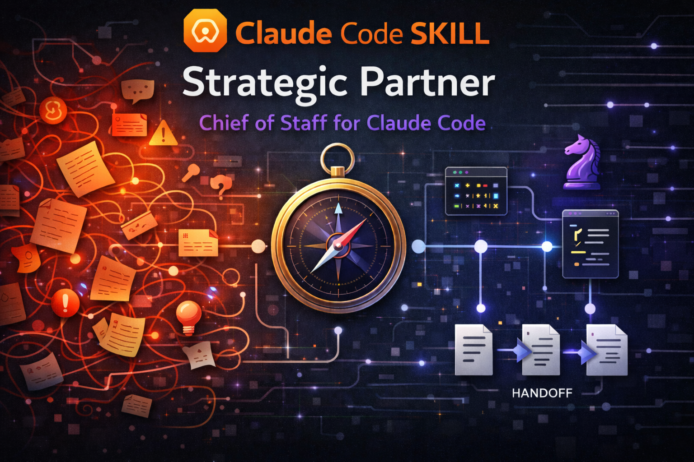

<p align="center">
  
</p>

[](CHANGELOG.md)

# strategic-partner

A strategic advisory skill for Claude Code (an installable add-on that extends Claude Code's behavior) that separates thinking from building. It thinks with you in one session — asking the right questions, challenging assumptions, framing problems before jumping to solutions. Then it packages implementation for fresh sessions where the full context window is available. Decisions persist. Context stays clean.

> **What's new — 7.9.0** — You can now report a Strategic Partner bug from
> inside any project, including a client's, with `/report-issue`: the draft is
> scrubbed twice, shown to you exactly as it would be posted, and filed only
> after you approve it — or saved to a local file when filing is unavailable or
> fails. Sessions also open with a short briefing instead of a checklist, and
> confirmation menus name the actual task rather than offering generic choices.
> See [CHANGELOG.md](CHANGELOG.md) for prior releases.

---

## The problem

AI coding assistants degrade as conversations grow. Every tool call, file read, and back-and-forth exchange pushes the original instructions further from the model's attention.

Think of it like a meeting that started with a clear agenda but kept going for six hours. By hour four, decisions are being made on autopilot — not because anyone stopped caring, but because the original focus got buried under everything that came after.

Strategic Partner fixes this by enforcing a separation: persistent advisory context where decisions accumulate, and disposable execution context where clean context matters most.

---

## Who is this for

**Solo developers** — A second brain that interrogates your assumptions before you build, picks the right tool, and remembers decisions across sessions so you don't re-litigate them.

**Team leads** — Consistent prompt quality across implementation sessions, with a decision log that survives context resets. Your architectural intent carries forward even when execution happens in fresh windows.

**Non-technical PMs** — You can describe what you need in plain language. The advisor handles the translation into technical prompts, breaks large features into phased delivery, and reports back in terms you can act on. You never need to know which skill or model is best for a task.

---

## How it works

### Two sessions, one loop

**Strategic Partner (SP for short)** runs the advisor in one session. Your installed implementation skills — or background agents — execute in another.

```
+----------------------------------+     +----------------------------------+
|  SESSION 1: ADVISOR (persistent) |     |  SESSION 2: EXECUTOR (ephemeral) |
|                                  |     |                                  |
|  Strategic Partner               |     |  /feature-dev — an external      |
|                                  |     |  skill, used here as an example  |
|  - Thinks with you               |     |  (or whatever skill SP picks)    |
|  - Challenges your assumptions   |     |                                  |
|  - Crafts implementation prompts |     |  - Builds what SP specified      |
|  - Routes to the right skill     |     |  - Keeps the settled decisions   |
|  - Tracks decisions and state    |     |  - Judges the rest itself        |
|  - Stays open across phases      |     |  - Commits when done             |
|                                  |     |                                  |
|  YOU KEEP THIS ONE OPEN.         |     |  Opens fresh. DISPOSABLE.        |
+----------------+-----------------+     +----------------+-----------------+
                 |                                        |
                 |  1. SP crafts prompt ----------------> |
                 |                                        |  2. You paste & run
                 |                                        |
                 |  4. SP reviews, plans next  <--------- |  3. You report back
                 +----------------------------------------+
```

**SP never builds, and the executor never re-opens a settled decision.** Product and architecture calls are made with you before the prompt is written, and the executor holds to them — while still making the ordinary implementation judgments any build needs, inside the boundaries the prompt sets. That split is what makes both halves work. SP reviews the actual diff of what landed, not just your summary, then crafts the next prompt.

---

## Quick start

> **Command names:** the plugin install prefixes every command with
> `/strategic-partner-plugin:`; the standalone install uses
> `/strategic-partner:`. Examples below use the plugin form.

### Install as a plugin (recommended — Claude Code manages the install)

```
/plugin marketplace add JimmySadek/strategic-partner
/plugin install strategic-partner-plugin@strategic-partner
/reload-plugins
```

To update, run both — the first refreshes the listing, the second moves the
install — then restart Claude Code:

```
/plugin marketplace update strategic-partner
/plugin update strategic-partner-plugin@strategic-partner
```

Plugin installs need no setup step: Claude Code reads the commands, hooks, and
voice style straight out of the plugin.

### Install as a standalone skill

```bash
git clone https://github.com/JimmySadek/strategic-partner.git <your-skills-dir>/strategic-partner
cd <your-skills-dir>/strategic-partner
./setup
```

Clone rather than using the skills CLI (the command-line installer that fetches
a published skill) — for this repository's layout it installs the main
instruction file only, without the commands, hooks, references, setup script,
and voice style.

`setup` registers the subcommands and installs the voice style (the formatting
profile that keeps replies scannable for non-technical readers). It installs the
style when none is present, keeps yours when one already is, and warns —
without overwriting — when your copy is stale or carries no version marker.
Optional: `./setup --audit-permissions` checks for permission gaps that cause
friction in advisory sessions. Later, `/strategic-partner:update` checks for a
newer release and updates in place. Restart Claude Code afterwards.

> **Tip:** invoking `/strategic-partner` for the first time also offers to run
> setup for you. The terminal command above stays the right choice for a
> scripted install, where no session is open to answer the prompt.

### Run

```
/strategic-partner-plugin:strategic-partner
```

Resume from a previous session by adding a handoff file path:

```
/strategic-partner-plugin:strategic-partner .handoffs/onboarding-flow-0304-1430.md
```

On the standalone install, `/strategic-partner`, `/advisor` and `/sp` all invoke
the same skill. The plugin format provides no alias mechanism, so the plugin has
none. Natural-language activation works on both.

---

## What you get

You say: *"We need to build an onboarding flow."*

**Without an advisor** — the session starts building a wizard. Three files in,
nobody has asked whether a wizard is the problem.

**With one** — SP names it as a solution wearing a problem's clothes and asks
what is actually going wrong. You say 60% of signups quit before connecting a
data source. SP reads your project rules file (`CLAUDE.md`, which Claude Code
loads automatically), notes React + Tailwind with no modal library, and puts
three approaches on the table — minimal, recommended, lateral — with a pick and
a reason for it. You choose. Only then does it write prompts.

| Phase | Target skill | What it does |
|-------|-------------|-------------|
| **1 — Research** | *[picked from your installed tools]* | Read 5 files, map existing auth flow, identify where onboarding state should live |
| **2 — Build UI** | *[picked from your installed tools]* | WelcomeScreen + 3-step wizard, mock data only, no backend calls yet |
| **3 — Wire up** | *[picked from your installed tools]* | Connect wizard to user state, trigger welcome email on step 3 completion |

Each prompt carries the files to read first, the constraints from your rules
file, a verification checklist, [✅ SAFE] / [⚠️ RISK] labels on key
recommendations, the expected commit message, and explicit out-of-scope
exclusions. You run each phase in a fresh session and report back; SP reviews
what landed and hands you the next one, until the feature ships.

---

## What's included

The advisor operates through a core instruction file (SKILL.md), supported by references loaded as needed:

- **Strategic advisory and prompt crafting** — the core loop: discover, challenge premises, present alternatives, route, craft, review. Prompts adapt to the target model and ship with hallucination-prevention and scope-discipline blocks built in.
- **Pre-build decision discipline** — every request is premise-checked, non-trivial tasks get more than one approach to choose from (minimal / recommended / lateral) before any routing, and recommendations carry [✅ SAFE] or [⚠️ RISK] confidence labels.
- **Plain-English partnership voice** — replies a non-technical reader can follow: decisions surfaced as structured choices, visual aids where they help, and anti-sycophancy rules that ban both empty agreement and performative pushback. The voice rules live in the skill core itself; the installable style file is a derived mirror kept in lockstep by a release-time check.
- **Skill and tool picking** — the advisor matches each task to the best of your installed tools and names its pick before anything runs, so a wrong choice gets caught early.
- **Cross-model adversarial review** — for high-stakes decisions, the advisor can send a curated brief to OpenAI's Codex CLI for an independent second opinion and synthesize the three-way view. A project can also make this a standing rule (`review-policy: cross-model-go-no-go`), so the reviewer is always a different model than the builder. Optional — requires Codex CLI installed.
- **Private bug reporting** — `/report-issue` drafts a Strategic Partner bug report from evidence already in the session, scrubs it twice, shows you the exact text that would be posted, and files it to SP's own tracker only after you approve — never to the tracker of the project you are working in.
- **Rules-file drift detection** — `/strategic-partner-plugin:context-file-scan` checks your project's rules file (`CLAUDE.md`, `AGENTS.md`, or `GEMINI.md`) for bloat, misplaced detail, SP-flavored framing, and high-confidence session-journey dumps; its proposal preflight catches destructive replacement attempts before writes.
- **Cross-session memory and handoffs** — decisions, findings, and parked work survive across sessions, and when context fills, a handoff file lets a fresh session pick up exactly where the last one stopped. Backlog review flags work that already shipped and asks before closing it.
- **Hands-off execution options** — small reversible tasks can be dispatched to a background agent with a desktop notification on completion; and when a bigger task fits a hands-off run, the advisor offers a ready-made `/goal` autonomous-run suggestion in chat — never written into the prompt or any saved file.

Mechanism detail lives in [ARCHITECTURE.md](ARCHITECTURE.md).

---

## Subcommands

| Command | What it does |
|---------|-------------|
| `/strategic-partner-plugin:help` | List all subcommands |
| `/strategic-partner-plugin:copy-prompt` | Copy a recently emitted prompt to the OS clipboard |
| `/strategic-partner-plugin:handoff` | Trigger a context handoff with split writes |
| `/strategic-partner-plugin:status` | Where we stand, what's done, what's next |
| `/strategic-partner-plugin:update` | Report your version and whether a newer release exists, then point to where updating happens (the standalone command also updates in place) |
| `/strategic-partner-plugin:serena` | Check, install, repair, verify, or roll back Serena with a preview first |
| `/strategic-partner-plugin:codex-feedback` | Cross-model adversarial review via Codex CLI |
| `/strategic-partner-plugin:context-file-scan` | Detect drift in `CLAUDE.md` / `AGENTS.md` / `GEMINI.md` rules files |
| `/strategic-partner-plugin:report-issue` — standalone form `/strategic-partner:report-issue` | Report an SP bug from any project: scrubbed draft, mandatory preview, filed only after you approve |
| `/strategic-partner-plugin:backlog` | Triage the project backlog (items grouped by lifecycle state, with an action menu) — including a scan that flags backlog work which has already shipped and asks before closing it |
| `/strategic-partner-plugin:switch-to-skill` | **Plugin only.** Switch this install back to the standalone skill |
| `/strategic-partner:try-plugin` | **Standalone only.** Switch this install from the skill to the plugin (leaner voice, faster startup) |

---

## Requirements

- **Claude Code** — the skill runs inside Claude Code sessions
- **`jq`** (a small command-line JSON processor) — install via `brew install jq` (macOS) or `apt install jq` / `dnf install jq` (Linux). Without it, the rules-file scanner won't run, the short session-opening summary is reduced, and rules-file writes plus background-agent dispatch refuse rather than guess. Ordinary chat and prompt delivery are not blocked.
- **Serena** (recommended) — an add-on server (an MCP server: the standard way Claude Code plugs into outside tools) that gives SP cross-session memory and semantic code search. SP works fine without it; what goes missing is Serena's own decision log and that search — SP's other stores (your project rules file, Claude Code's own saved notes, and handoff files) carry on unchanged. SP-managed Serena binds to the exact repository or checkout you are in, starts without opening a browser tab, preserves existing memories, and never changes the setup without approval.
- **Context7** (optional, also an MCP server) — library documentation lookup
- **Codex CLI** (optional) — cross-model adversarial review

### Supported platforms

| Platform | Status |
|---|---|
| macOS 13.0+ / Linux (GNU coreutils) | ✅ Fully supported |
| Windows WSL2 (recommended) / WSL1 | ✅ Supported — inherits Linux support (WSL1: Claude Code sandboxing unavailable per Anthropic) |
| Windows native (Git Bash / MSYS2 / Cygwin) | ⚠️ Experimental — symlink/interpreter/install-path limits; needs `SP_ALLOW_NATIVE_WINDOWS=1`. Use WSL2 |
| Windows native (cmd / PowerShell) | ❌ Unsupported — Claude Code requires a Bash-compatible shell |

---

## Troubleshooting

| Scenario | What happens | What to do |
|---|---|---|
| **Serena missing, unreliable, or noisy** | Cross-session memory and semantic navigation are reduced; you may also see a browser tab open on start, or two Serena servers running at once | Run `/strategic-partner-plugin:serena`. SP diagnoses locally, previews the smallest safe fix, and keeps working with repository-native search if you decline. |
| **Skills missing** | The installed-tool picker can't match a task to an installed skill | SP routes to built-in Agent types (always available) or suggests installing the skill. |
| **No automatic warning before context fills up** | SP relies on self-assessed thresholds and periodic checks | A user-owned hook (a script Claude Code runs on an event — here, the signal it fires just before it compacts a full context) can serve as an extra backstop if you choose to configure one. |
| **Sub-agents hit permission walls** | Background agents can't prompt for approval | Specify `mode` on every agent spawn. Pre-approve `WebFetch(*)` and `WebSearch(*)` in `~/.claude/settings.json` for research agents. Run `./setup --audit-permissions` to check for gaps. |
| **Implementation session fails** | Executor reports errors or incomplete work | Report back to the SP. It will diagnose, rewrite the prompt with a different approach, and suggest retry. |
| **Codex CLI not found** | Cross-model review unavailable | Install from [github.com/openai/codex](https://github.com/openai/codex) and run `codex login`. Feature is optional. |

---

## License

MIT
